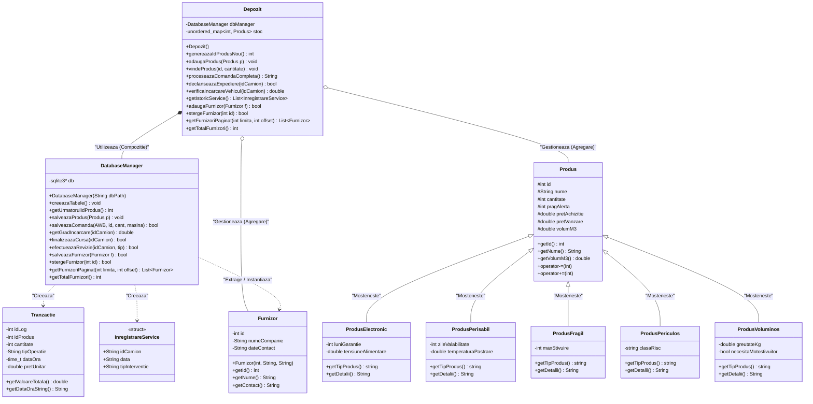

# Sistem Integrat de Monitorizare Depozit și Logistică (ERP)

Acest repository conține implementarea unui sistem de tip Enterprise Resource Planning (ERP), dezvoltat în C++17. Proiectul integrează module de WMS (Warehouse Management), TMS (Transport Management) și CMMS (Mentenanță Flotă), fiind arhitecturat pentru a rula în medii Linux/WSL. Accentul este pus pe persistența robustă a datelor, decuplarea componentelor și o interfață utilizator reactivă în terminal.

## Arhitectură și Caracteristici Principale

* **Persistență Relațională (SQLite3):** Stocarea datelor este gestionată printr-un motor de baze de date relațional, serverless. Sistemul garantează integritatea informațiilor prin tranzacții SQL securizate (utilizând instrucțiuni preparate pentru prevenirea injecțiilor) și oferă un jurnal de audit inalterabil pentru toate tranzacțiile și operațiunile de service.
* **Interfață Reactivă (Terminal UI):** Frontend-ul este construit folosind biblioteca FTXUI, implementând un model asincron de tip "Live-Refresh". Componentele vizuale (formulare, tabele paginate, indicatoare de progres volumetrice) interoghează baza de date și se randează reactiv, prevenind desincronizarea stărilor (Stale UI).
* **Management Logistic Integrat (WMS & TMS):** Suport complet pentru fluxul operațional: recepția polimorfică a mărfurilor, gestionarea pragurilor critice de stoc, generarea codurilor de urmărire (AWB) și alocarea dinamică a sarcinilor pe o flotă diversificată de vehicule, respectând limitele volumetrice.
* **Mentenanță Automatizată (CMMS):** Implementarea unei mașini de stări finite (Finite State Machine) bazate pe proceduri SQL care monitorizează ciclul de uzură al flotei. Vehiculele sunt imobilizate automat pentru revizii tehnice după atingerea limitelor de exploatare predefinite.
* **Design Modular și OOP:** Codul respectă principiul de separare a responsabilităților (Separation of Concerns). Nivelul de persistență (`DatabaseManager`), logica de business (`Depozit`) și nivelul de prezentare sunt strict decuplate. Arhitectura de produse utilizează moștenirea și polimorfismul pentru a modela comportamente specializate.

## Stack Tehnologic

* **Limbaj:** C++17
* **Bază de Date:** SQLite3
* **Frontend:** FTXUI (Functional Terminal UI)
* **Sistem de Build:** CMake (versiunea 3.10 sau superioară)
* **Sistem de Operare:** Linux (Testat și validat pe Ubuntu 24.04 via WSL)

## Diagrama UML a Claselor



## Structura Arborescentă a Proiectului

Organizarea fișierelor respectă convențiile standard C/C++:

* `include/` - Conține fișierele header (`.h` / `.hpp`), expunând contractele și definițiile claselor.
* `src/` - Conține fișierele sursă (`.cpp`), incluzând logica de domeniu, interfațarea UI și implementarea persistenței.
* `docs/` - Conține documentația proiectului sub formă de fișier .pdf
* `tests/` - Conține suita de teste automate pentru validarea logicii de business și a persistenței.
* `CMakeLists.txt` - Definește directivele de asamblare și managementul dependențelor externe.
* `build/` - Directorul de output pentru asamblarea out-of-source (exclus din controlul versiunii). *Notă: La prima rulare, motorul SQL va genera automat fișierul `.db` în acest director.*

## Instrucțiuni de Compilare, Testare și Rulare

Pentru a compila proiectul pe un mediu Linux, asigurați-vă că aveți instalat toolchain-ul C++ și librăria de dezvoltare pentru SQLite3 (ex: `sudo apt install libsqlite3-dev`).

**1. Generarea fișierelor de configurare:**
```bash
cmake -B build
```

**2. Compilarea codului sursă:**
Această comandă va asambla atât executabilul principal al interfeței grafice, cât și executabilul suitei de teste.
```bash
cmake --build build
```

**3. Rularea suitei de teste automate (Validation & CI):**
Este recomandată validarea integrității codului și a bazei de date înainte de a lansa aplicația în producție.
```bash
./build/test_app
```

**4. Execuția aplicației principale (Linux Nativ):**
```bash
./build/depozit_app
```

**Notă pentru utilizatorii Windows Subsystem for Linux (WSL):**
Dacă doriți să lansați interfața aplicației direct dintr-un terminal host (Windows CMD sau PowerShell) fără a deschide o sesiune interactivă bash în prealabil, utilizați următoarea comandă:
```powershell
wsl ~/SistemMonitorizareDepozit/build/depozit_app
```
